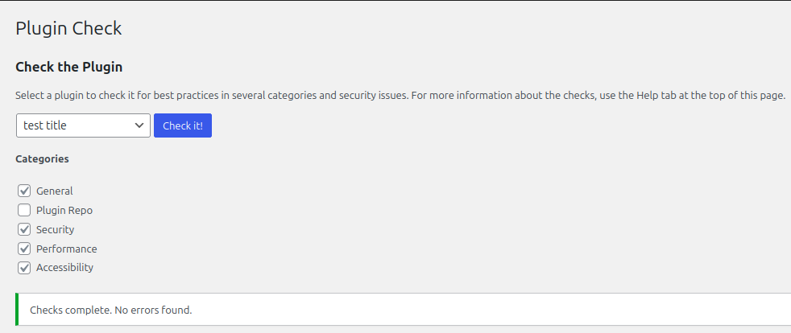

# @toolbox-wp/build-block

⚠️ **EARLY DEVELOPMENT NOTICE:** This project is in active development (v0.1.x) and APIs are subject to change.

Similar to [@wordpress/create-block][npm-@wordpress/create-block] with modern
tooling, enhanced TypeScript support, default [interactivity
api][ref-wp-interactivity] integration, and readily available config files.

## Built With

- [![shield-ts]][ref-tslang-org]
- [![shield-wp]][ref-wp-org]

  - 

libs

    This project is built to generate projects adhering to the modern [Block
    Editor Paradigm][ref-wp-be-handbook]

    - Package References

      - [Interactivity][ref-wp-interactivity]
      - [Blocks][ref-wp-blocks]
      - [Components][ref-wp-components]
      - [Element][ref-wp-element]

   

- [![shield-react]][ref-react-org]
- [![shield-vitest]][ref-vitest-dev]
- [![shield-prettier]][ref-prettier-io]
- [![shield-tseslint]][ref-tseslint-io]
- [![shield-pnpm]][ref-pnpm-io]
- [![shield-commander]][ref-commander-github]
- 

## RoadMap

- [ ] **Rework Validator Error handling**. Current system does not provide
      meaningful messages and is overly complex. Validation has been relaxed in
      some areas to accommodate this (e.g. urls are just validated to be
      strings)
- [ ] Extend and improve interactive cli
  - [ ] Allow dynamic selection of options to configure to allow full
        configuration from the cli without a config file.
- [ ] Finish Package.json input configuration handling
- [ ] Integrate more of the
      [WP Plugin Check](https://wordpress.org/plugins/plugin-check/)
      rules/recommendations directly
- [ ] Document
  - [ ] Logo/Banner
  - [ ] Installation
  - [ ] Examples/Guides
  - [ ] Changelog
  - [ ] Contributing
  - [ ] Table of Content
  - [ ] Generated files and structure
  - [ ] Features
  - [ ] Comments
  - [x] Coverage, Dependencies
        [(dep-cruiser)](https://github.com/sverweij/dependency-cruiser)
- [ ] Implement CI/CD pipeline
- [ ] Complete testing/coverage (include validation of every input config
      method)
- [ ] Centralize more template data like shared ignore files

## Features

### Flexible configuration
  - Interactive CLI: Guides you through setting up a project using the terminal.
  - **build-block.(json|ts|js)**
    - TypeScript/JavaScript modules: TypeScript is recommended for typechecking
      ensuring no runtime errors when generating. Import the config function or
      Builder class from the api and export the result.
    - JSON: Use the JSON schema for guidance and validation.

### WordPress.org Compatibility
- **WordPress.org Ready** - Built to pass WordPress Organization guidelines and requirements
  - WordPress Plugin Check compliance
   
- Proper `.distignore` configuration for clean distribution packages (use the `plugin-zip` script provided by `wp-scripts` to remove non-compliant hidden-files)
## License

Copyright &copy; 2025 Nolan Gajdascz

[Email](dev.gajdascz@gmail.com) | [GitHub](https://github.com/gajdascz)

Distributed under GPLv2+ in compliance with WordPress licensing requirements.
See [LICENSE](./LICENSE) for more information.

(<a href="#readme-top">back to top</a>)

<!--
  References and Documentation
-->

[npm-@wordpress/create-block]:
  https://www.npmjs.com/package/@wordpress/create-block
[ref-wp-org]: https://wordpress.org/
[ref-wp-interactivity]:
  https://developer.wordpress.org/block-editor/reference-guides/interactivity-api/
[ref-wp-blocks]:
  https://developer.wordpress.org/block-editor/reference-guides/packages/packages-blocks/
[ref-wp-be-handbook]: https://developer.wordpress.org/block-editor/
[ref-wp-be-fundamentals]:
  https://developer.wordpress.org/block-editor/getting-started/fundamentals/
[ref-wp-components]:
  https://developer.wordpress.org/block-editor/reference-guides/packages/packages-components/
[ref-wp-element]:
  https://developer.wordpress.org/block-editor/reference-guides/packages/packages-element/
[ref-tslang-org]: https://www.typescriptlang.org/
[ref-vitest-dev]: https://vitest.dev/
[ref-react-org]: https://reactjs.org/
[ref-prettier-io]: https://prettier.io/
[ref-tseslint-io]: https://typescript-eslint.io/
[ref-pnpm-io]: https://pnpm.io/
[ref-commander-github]: https://github.com/tj/commander.js

<!-- MARKDOWN LINKS & IMAGES -->
<!-- https://www.markdownguide.org/basic-syntax/#reference-style-links -->

[shield-ts]:
  https://img.shields.io/badge/TypeScript-3178C6?logo=typescript&logoColor=fff
[shield-wp]:
  https://img.shields.io/badge/WordPress-%2321759B.svg?logo=wordpress&logoColor=white
[shield-vitest]:
  https://img.shields.io/badge/Vitest-%235a711d?style=flat&logo=vitest&logoColor=%23fcc72b&labelColor=%235a711d
[shield-react]:
  https://img.shields.io/badge/React-%2320232a.svg?logo=react&logoColor=%2361DAFB
[shield-prettier]:
  https://img.shields.io/badge/Prettier-%231a2b34?style=flat&logo=prettier&logoColor=%23f7ba3e&labelColor=%231a2b34
[shield-tseslint]: https://tinyurl.com/base64-tseslint-img
[shield-pnpm]: https://img.shields.io/badge/pnpm-%234e4e4e?style=flat&logo=pnpm
[shield-commander]:
  https://img.shields.io/badge/Commander-%23663399?style=flat&logo=terminal&logoColor=white
